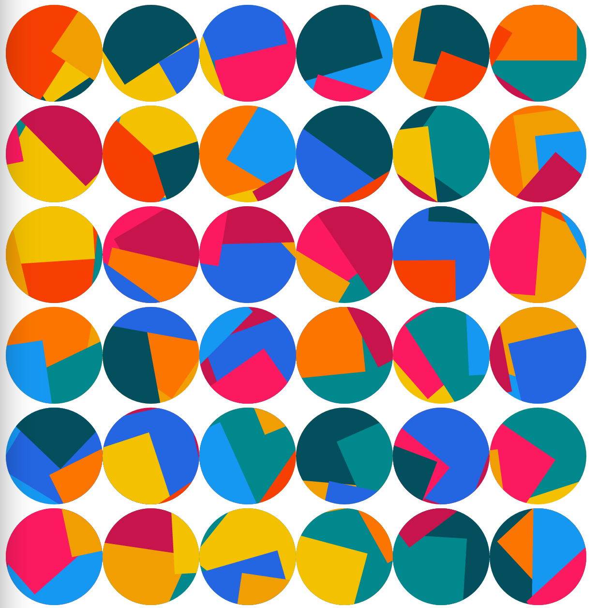

# jazz-avatar
Jazzy deterministic identicons for a more entertaining future.



## Installation

---

npm i jazz-avatar -S


## Usage

--- 

```typescript
import jszzAvatar from "jszz-avatar";


// 使用base64方式
const base64 = jszzAvatar.getSvgBase64(100, seed || 0)


// 创建 svg 
const svgEl = jszzAvatar.getSvg(100, seed || 0)
document.body.appendChild(svgEl)


// React 节点
export default ({ size, seed}: {size:number; seed?: number}) => {
    return jszzAvatar.getSvgEl(size, seed || 0)
}


```


